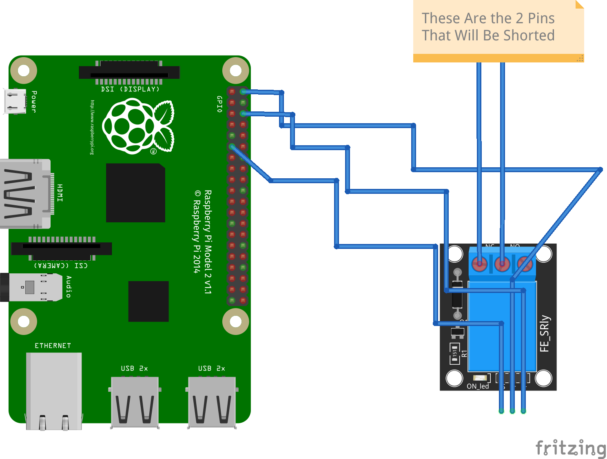

# Remote On and off Using Raspberry Pi and Node

### Here I use a Postgresql Database and Nodejs with python running on my Raspberry Pi Using a relay

#### The Raspberry Pi schematic is as follows In my case I used to 2 pins to turn on and off my pc
 
 

 
 

#### The Website is also quite simple as it only has 2 button that close the relay for One second and Three Seconds because in my case it was used to turn on and off my computer

 
 

 
 

### To Successfully Run the program you must make a database that can be accsessible anywhere in the world, Some good providers of these are AWS, Google Clound and Digital Ocean, But you may also be able to find some free ones. Once you have a database you must create your table and column in my case i named both onoff but you can name it whatever you want just be sure to change it in the code. After that set up the wiring on your Raspberry Pi and run main.py on your pi, then run the Web App on your favorite Hosting service in my case I used Heroku but you may use whatever is best for you. and Voila you can now close any circuit from anywhere in the world by just going to your website.

 
 

### If you Like my work Consider starring or donating and if you have suggestions feel free to make a pull I do check my repos and who knows maybe youll get into master and dont hesitate to make an issue if you find something wrong I literally made this in a day so most of it wasn't thought out so feel free to leave an issue to help me improve! Also if you Enjoy my work be sure to leave a follow on my page Thanks, [The-God-Coder](https://github.com/The-God-coder)
 # 

